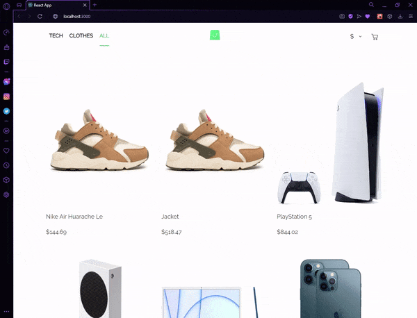

# React e-commerce website with graphQL api on Apollo server and opus builder

## General info

Here I'm building e-commerce website, basicly to learn how to use graphql api data from Apollo server and using opus to generate graphql requests.
I have just started working on that project

