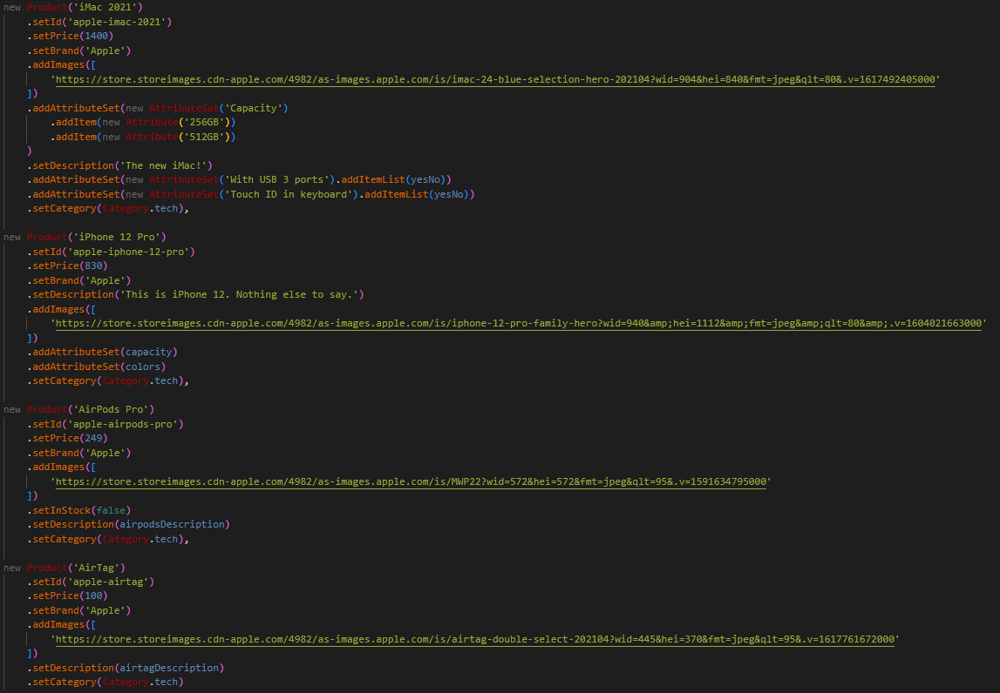

# React e-commerce website with apollo graphQL api and with [tilework/opus](https://github.com/tilework/opus) builder

* [General info](#general-info)
* [Technologies](#technologies)
* [Features](#features)
* [Fixes based on feedback](#fixes-based-on-feedback)
* [Preview](#preview)

## General info

###### This application fetch data from the GraphQL endpoint and provide an interface to view and interact with this data. 

Products can be filtered according to three categories. Products are checked for presence in the warehouse. The application includes a Product Details Page where you can change product photos (if provided from the server). The user has to select the available options for the product and can add it to the cart. Then the product appears in a small cart tab, where you can still change the options of each product. From this tab you can go to the "Cart" route where you can still edit product options, change photos, add quantity, delete, change selected options. The application summarizes the current cost of the cart and adds tax to it.
The solution had been implemented as per design, which is available at this [link](https://www.figma.com/file/MSyCAqVy1UgNap0pvqH6H3/Junior-Frontend-Test-Designs-Public?node-id=0%3A1).

## Technologies
1. The application was written using React framework
2. Only class components have been used in the application
3. Both regular CSS (inline and in seperate files) and CSS-in-JS approach allowers (styled-components) were used in the application

## Features 
- PLP - product listing page
- PDP - product description page
- Cart page + Cart overlay (minicart)

## Fixes based on feedback
 - [x] Clicking green cart botton should add product to cart with first pre selected attribute values
 - [x] Routing not working correctly\
   `I have followed these instructions: https://github.com/remix-run/react-router/blob/v2.5.2/docs/API.md#link`
 - [x] Add to cart functionality does not work (redirects and shows white space)\
    `I am not sure how the functionality of the 'add to cart' button does not work, I checked this functionality and it seems to work fine, also I have fixed issue with white spaces`
 - [x] Out of stock should be accessible but impossible to buy
 - [x] Could not find product secondary images\
    `I am not sure if I understood the objection correctly, but in the endpoint I downloaded some products only have one picture`
    

 - [x] Dont fetch every category at once. (Fetch only 1 for current category)
 - [x] Also same request is sent multiple times

## Preview

https://user-images.githubusercontent.com/81425551/193557539-012e5e87-ec35-4b89-9952-62af852cb53a.mp4

