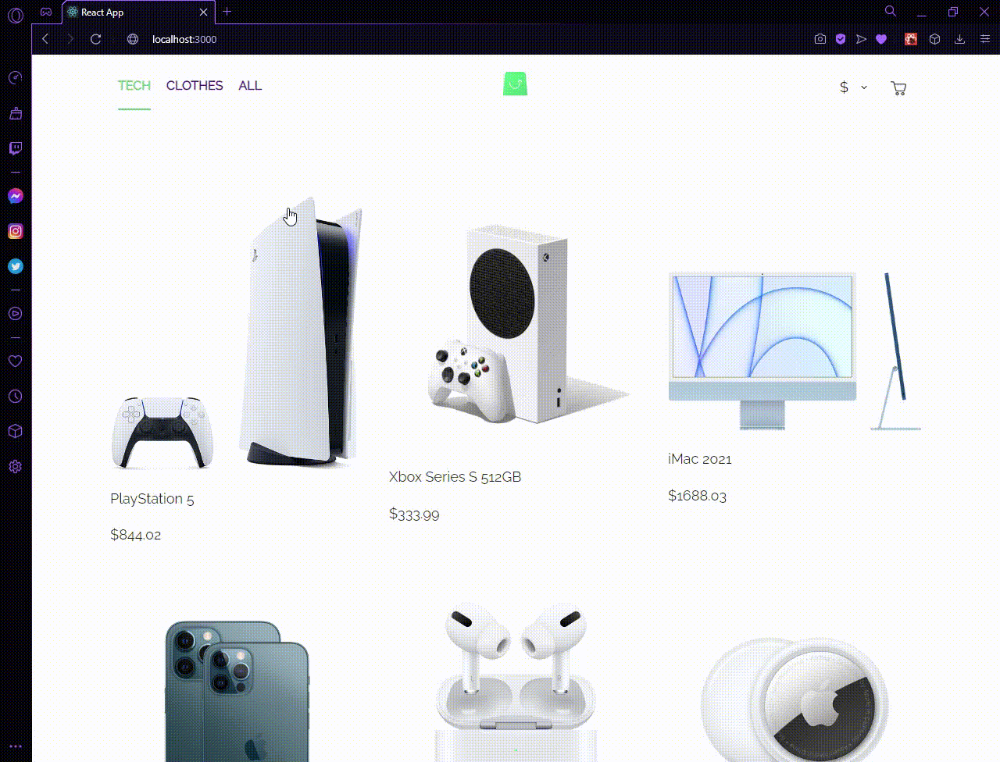

# React e-commerce website with graphQL api on Apollo server and with opus builder

## General info

Here I'm building e-commerce website, basicly to learn how to use graphql api data from Apollo server and using opus to generate graphql requests.

The last thing i have to do is to create cart tab where i will handle added products (add, delete, number of added products)

I have not used any libraries apart from styled-components && opus

